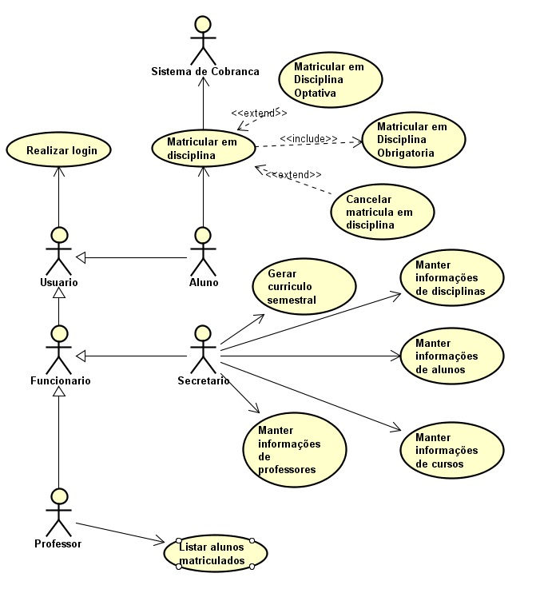

# Sistema de Matrícula

## História de Usuários

| Como |  Desejo  | Para |
|:--------|:--------:|-----:|
| Secretária   | Gerar a grade curricular para cada semestre, mantendo informações de alunos, professores e matérias | Possibilitar a inscrição de alunos e professores em disciplinas |
| Aluno  |  Me matricular em disciplinas de meu curso  | Cursar durante o semestre |
| Professor | Acessar o sistema de matrículas | Visualizar os alunos cadastrados em cada disciplina |
| Usuário | Realizar login no sistema | Gerenciar meus dados |
| Agente de Cobrança | Receber uma notificação a respeito da matrícula do aluno | Realizar as cobranças no decorrer do semestre |

## Requisitos

### Requisitos Funcionais

| RF | Descrição | Complexidade |
|:-----|:---------:|-----:|
| 01   | A Secretária gera o currículo semestral | 3 |
| 02   | A Secretária gerencia informações de professores, alunos e disciplinas | 3 |
| 03   | O Aluno se matricula em uma disciplina | 2 |
| 04   | O Usuário deve realizar login no sistema | 1 |
| 05   | O Professor visualiza alunos em suas disciplinas | 2 |
| 06   | O Sistema envia à Agente de Cobrança a notificação de matrícula do aluno | 3 |

### Regras de Negócio

| RN | Descrição | Complexidade |
|:-----|:---------:|-----:|
| 01   | Cada curso deve possuir um nome, número de créditos e uma lista de disciplinas | 1 |
| 02   | Os alunos podem se matricular em até 6 disciplinas, sendo elas 4 obrigatórias e 2 optativas | 3 |
| 03   | As matrículas só podem ser criadas/alteradas num período entre 1 semana após o término do semestre atual e 1 semana antes do início do próximo semestre | 5 |
| 04   | Uma disciplina deve ter, no mínimo, 3 alunos. Caso contrário, a mesma é cancelada no semestre seguinte | 1 |
| 05   | Uma disciplina deve ter, no máximo, 60 alunos. Caso contrário, as matrículas são encerradas para a mesma | 2 |
| 06   | Cada usuário deve possuir uma senha para seu respectivo login | 2 |

## Diagrama de Casos de Uso

### Diagrama

## Diagrama de Classes

### Diagrama

